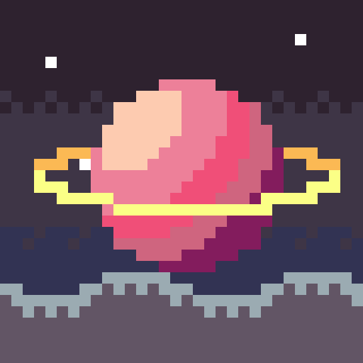
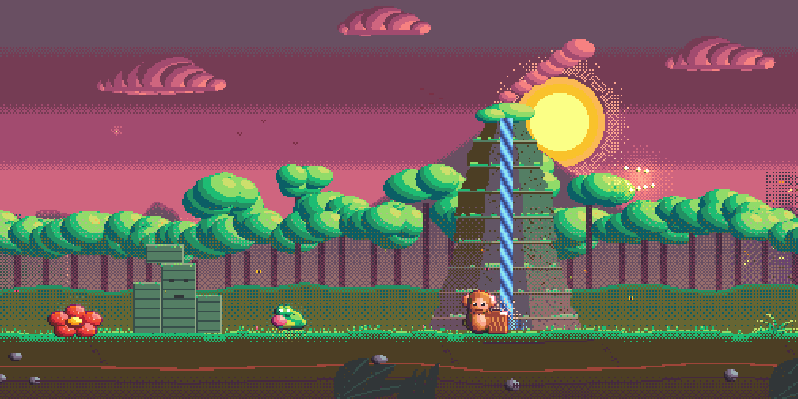
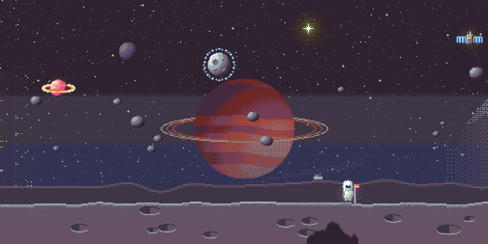
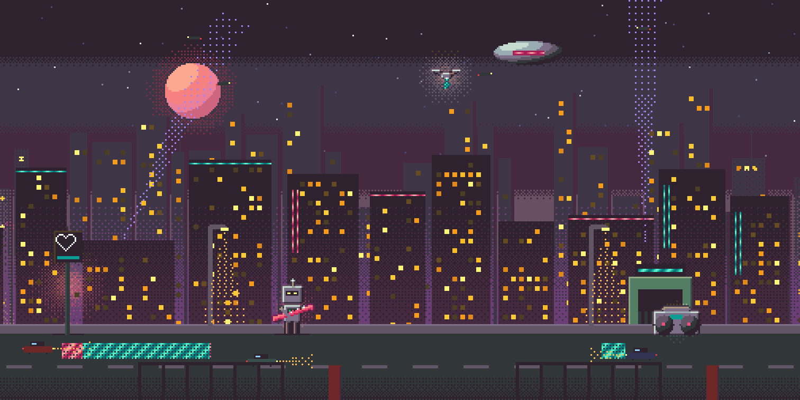
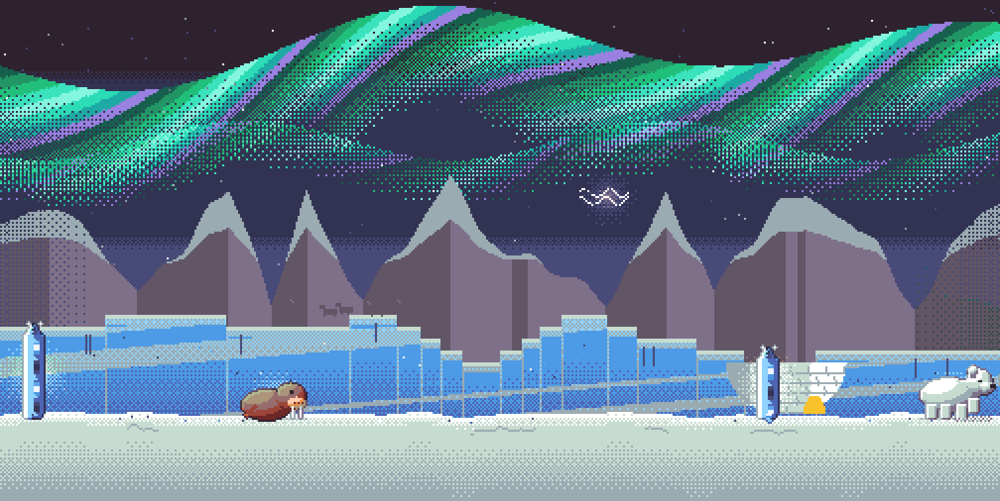
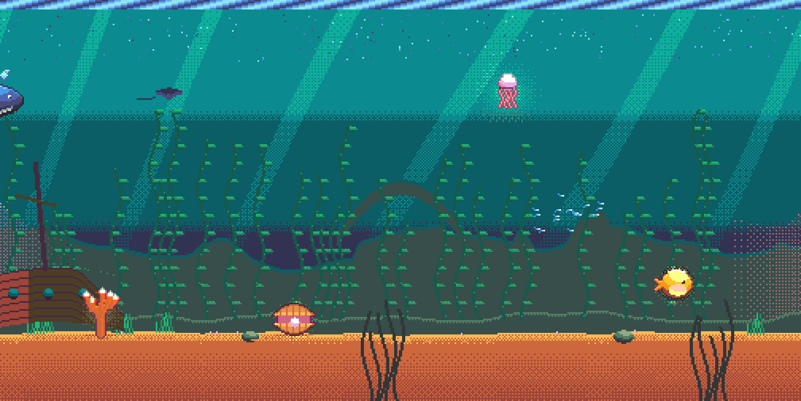
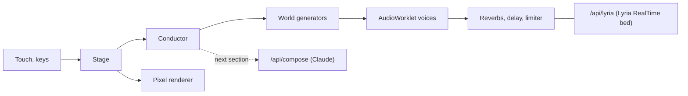

<div align="center">
  

  <h1>Biome Synth</h1>

  <p>
    A pixel world you play. Every creature is an instrument.
    <br /><br />
    <a href="https://github.com/barmoshe/biome-synth/issues">Report a bug</a>
  </p>

[](https://github.com/barmoshe/biome-synth/actions)
[](#how-it-works)

</div>

<p align="center">
  
</p>

Biome Synth is a browser instrument shaped like a side-scrolling game. You drift through five worlds, and each one has its own music: its own tempo, meter, drums, effects and way of making notes. Tap a creature and it plays its part in key. Slide across the sky to lead. Leave it alone and the creatures play by themselves.

I first built it in April 2026. This is a rebuild from scratch, with a hand-written synth engine, a pixel renderer, and an AI band that writes the next section while the current one plays.

## The five worlds

| World | Music | Tempo and feel | What the creatures do |
|---|---|---|---|
| Orbit | Kosmische sequencer music, no drums | 96 bpm, a 7-note ostinato drifting against the bar | Each one is a planet on an orbit; a tap pushes it to a wider, slower orbit |
| Aurora | Tintinnabuli bells, in the style of Arvo Pärt | Free time, events come on irregular breaths | Every melody note gets its harmony note from the B minor triad, automatically |
| Deep | Dub techno | 118 bpm, light swing | A tap throws that note into a tape delay that swells and fades over two bars |
| Canopy | West African 12/8 bell rhythms and highlife | 12/8, dotted quarter at 108 | Two creatures split one fast melody between them; the parrot answers your phrases |
| Neon | Rainy UK 2-step garage with brass pads | 132 bpm, 58% swing, sidechain pumping | The drones arpeggiate the chord; the kick pattern changes every two bars |

Crossing from one world to the next happens on a bar line, through a short bridge: the drums drop out, the tempo moves, and the new world starts on its downbeat.

<p align="center">
  
  
</p>
<p align="center">
  
  
</p>

## How to play

- **Tap a creature:** it plays its part, always in key.
- **Slide across the sky:** you lead. Fast slides play short bright notes, slow ones sing. Sweep over creatures to strum them.
- **Flick:** throws a shooting star that plays a quick run of notes in tempo.
- **Travel:** the map at the bottom, the arrow keys, or a scroll.
- **Keys:** 1 to 7 play the band, M mutes, R records a clip, D changes the camera, H shows help.

Headphones help: the low end carries a lot of it.

## Run it

```bash
npm install
npm run dev
```

Then open http://localhost:5188. Everything plays locally; the AI band is optional.

To run the full app with its Worker (the way it is deployed):

```bash
npm run preview
```

## How it works

- **Sound:** one AudioWorklet runs every voice: chip-style pulse, triangle and noise, plucked strings, struck bells, resonators for ice and wood, a formant voice. Events carry an exact sample time from a lookahead clock, so timing never depends on the page. Reverbs, a dub delay and a limiter sit in a small Web Audio graph. No audio library.
- **Music:** each world is a generator with its own clock (steps per bar, swing, humanised timing), kit and rules. A conductor walks each world through sections and handles the crossings.
- **Pictures:** a 64-colour indexed framebuffer at about 270 pixels tall, scaled up by whole numbers so it never blurs. Shade tables do the lighting: distant layers fade into each world's air, glows are dithered rather than blurred, creatures get outlines and rim light. Water, aurora and neon animate by colour cycling, driven by the music.
- **AI band (optional):** a Cloudflare Worker serves the app and two endpoints. Claude writes the next section as JSON while the current one plays; the browser clamps it and swaps it in on the boundary, and if it is late the world's own section plays. Lyria RealTime can stream an AI audio bed under the band, steered by where you are; the Worker relays the session and holds the key.



## Configuration

The AI band needs two Worker secrets. Without them the app works and the menu shows the AI parts as not set up.

| Setting | What it does |
|---|---|
| `ANTHROPIC_API_KEY` (secret) | Turns on the Claude conductor |
| `GEMINI_API_KEY` (secret) | Turns on the Lyria RealTime bed |
| `AI_ENABLED` (var) | `0` switches the AI band off without a deploy |
| `COMPOSE_FIXTURE` (var) | `1` serves a fixed section instead of calling Claude, for local testing |

Per-IP rate limits for both endpoints are in `wrangler.jsonc`. A Lyria session ends after ten minutes. While the bed plays, the screen says it is AI music.

## Development

```bash
npm run typecheck
npm test                        # voices, clock, worlds, transitions, the Worker
SNAP=1 npx vitest run           # renders every world to PNG in ./snaps
SNAP=render npx vitest run      # renders WAVs of each world and a full journey in ./renders
SNAP=brand npx vitest run       # redraws the icons and the share image
```

Built with React for the HUD, Vite, TypeScript, Hono and Cloudflare Workers.
